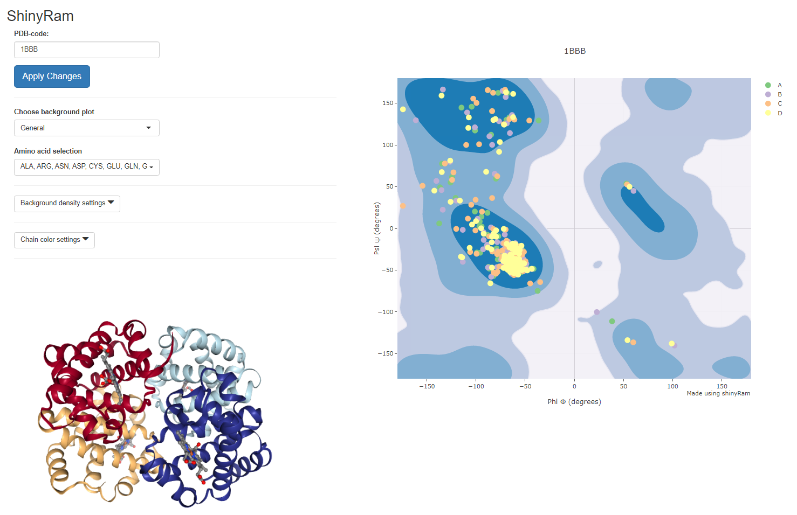

# RamplotR

R shiny app for making Ramachandran plots.

The calculation of the density backgrounds for the ramachadran plots is done based on the list of proteins proposed by [Lovell et al. (2003)](https://pubmed.ncbi.nlm.nih.gov/12557186/).

## Usage

### Published version

This app is published via shinyapps.io and can be used via https://bioit.shinyapps.io/RamplotR/.

### Install it yourself

1. Install R from the [website](https://www.r-project.org/) (tested using v4.03)
2. Run the following code:

```R
# Install the packages above if they are not already installed
installed_packages <- rownames(installed.packages())
required_packages <- c("shiny", "shinycssloaders", "shinyWidgets", "colourpicker", "bio3d", "plyr")
for (p in required_packages) {
  if (!(p %in% installed_packages)) {
    install.packages(p)
  }
}
```

3. Run the app.R script

## Example image of the app



## To be done

- Custom PDB upload support
- Add CIF support
- Output a statistic output of the number of residues in each region
- Output a list of residues in each region
- Recalculate the density backgrounds with newer best proteins?
- Optimize the calculation of the torsion angles (now with bio3d but can be quite slow)
