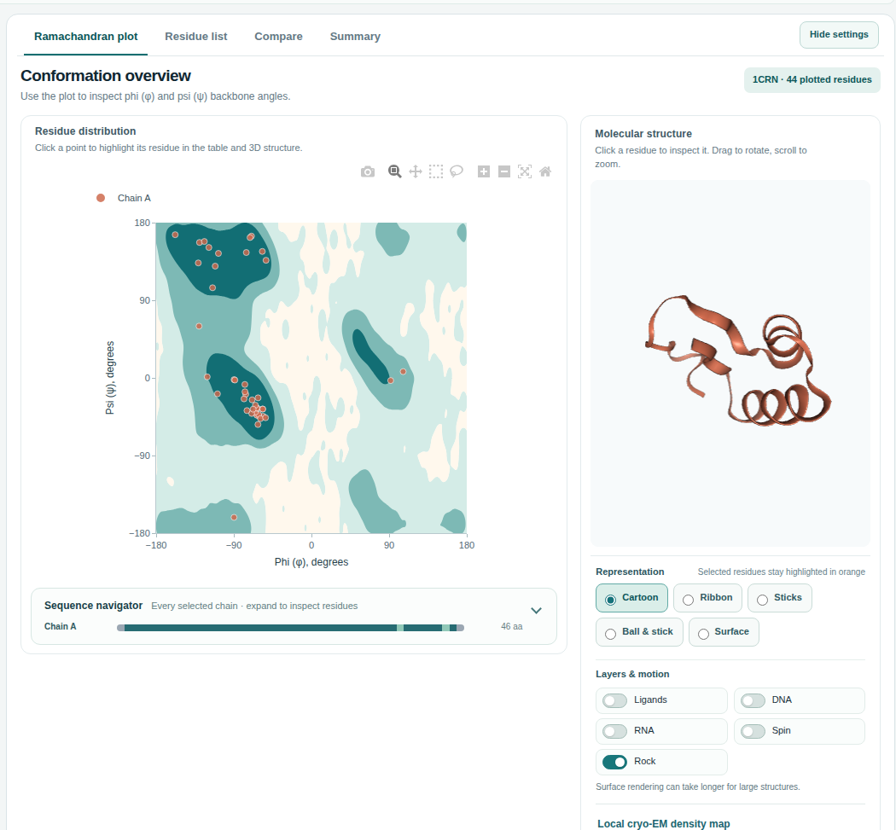
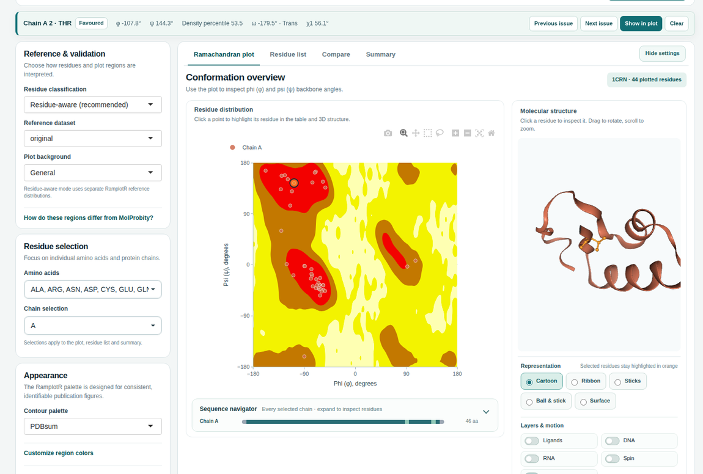
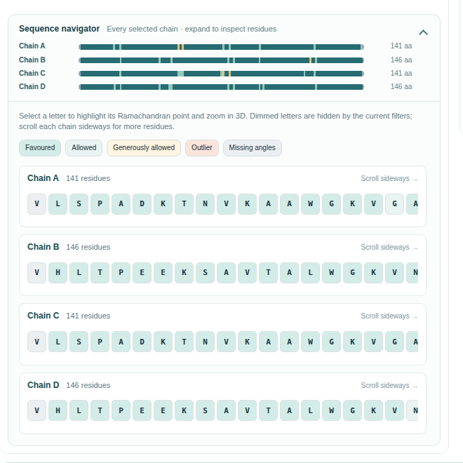
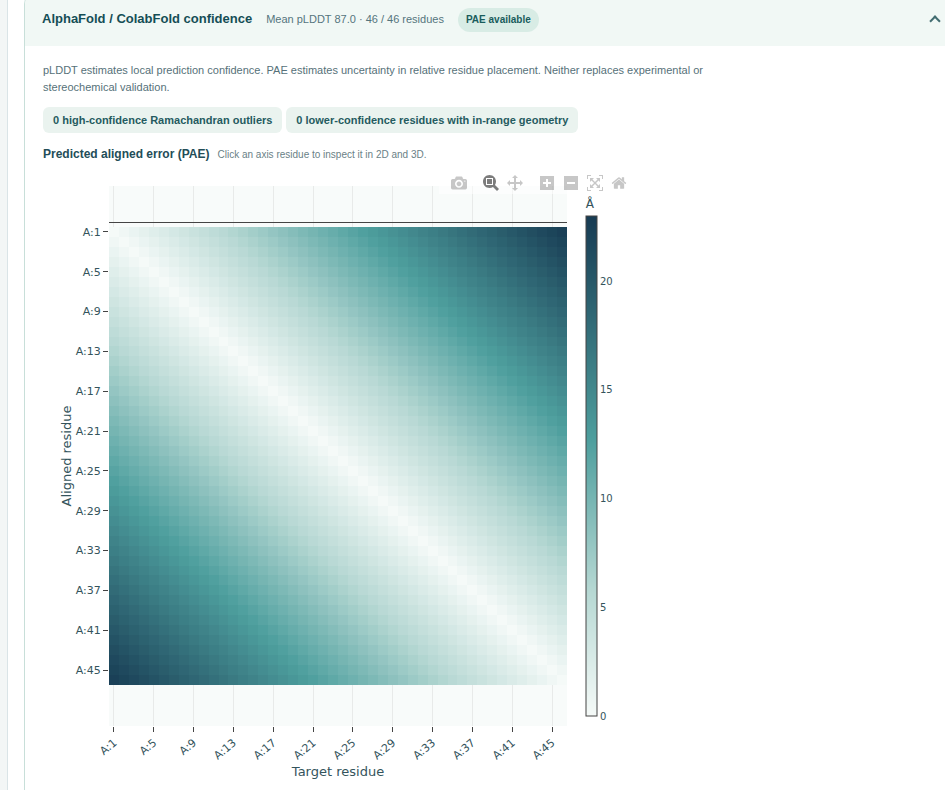
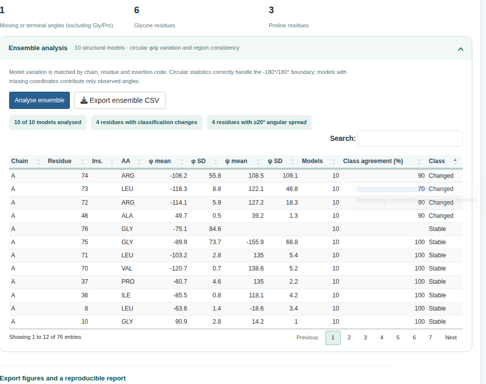

# RamplotR

**Interactive protein-structure inspection and Ramachandran analysis, from experimental structures to AlphaFold and ESMFold predictions.**

RamplotR is an open-source R Shiny application that brings backbone geometry, a 3D molecular viewer, residue-level validation and prediction confidence into one linked workspace. Click a residue in the plot, sequence, table or structure to inspect it everywhere. Compare conformations, examine multi-model ensembles and export figures or reproducible reports.



*RamplotR's default publication palette. Example: PDB [1CRN](https://www.rcsb.org/structure/1CRN). [More screenshots](#screenshots).*

[**Get started**](#get-started) · [**Explore the features**](#what-you-can-do) · [**Scientific interpretation**](#scientific-interpretation) · [**Documentation**](#documentation)

## What you can do

| Workflow | Capabilities |
| --- | --- |
| **Explore a structure** | Interactive φ/ψ plots with several reference-density datasets, residue-aware classification and instant amino-acid/chain filtering. |
| **Inspect residues in context** | Synchronized Ramachandran plot, searchable residue table, all-chain sequence navigator and NGL 3D viewer. Selected residues are highlighted and brought into focus; an issue queue helps navigate outliers and missing angles. |
| **Work with predicted models** | Import AlphaFold DB models by UniProt accession or upload AlphaFold 2/3, ColabFold and ESMFold structures. Examine pLDDT, and view a linked PAE heatmap when compatible confidence data are available. |
| **Examine structural geometry** | Explore peptide ω, side-chain χ1 and descriptive Cβ measurements. Optionally attach the matching deposited structure's official wwPDB validation report for independent rotamer, clash and geometry annotations. |
| **Inspect experimental evidence** | Overlay a local CCP4/MRC cryo-EM map in the 3D viewer as a qualitative aid, without uploading the map to a separate service. |
| **Compare models** | Sequence-align chains from two structures; inspect wrapped angular differences and changes in classification. For compatible multi-model structures, calculate circular φ/ψ variability and classification consistency. |
| **Publish or automate** | Export SVG and high-resolution PNG figures, filtered CSV tables and standalone HTML reports. Run the offline R command-line tool on individual files or a directory of structures. |

Advanced analysis stays in collapsible panels or dedicated comparison/summary views, keeping the everyday 2D/3D inspection screen uncluttered.

## Screenshots

All images below are taken from [real browser tests](docs/screenshots/README.md). The prediction-confidence example uses **synthetic test data** to demonstrate the interface, not a biological result.

| Linked residue inspection | All-chain sequence navigator |
| :---: | :---: |
|  |  |
| **Prediction confidence and PAE** | **Multi-model ensemble analysis** |
|  |  |

## Get started

### Run the interactive app

Install [R](https://www.r-project.org/) (a current R 4.x release), clone the repository and start the Shiny application:

```bash
git clone https://github.com/BiKC/RamplotR.git
cd RamplotR
```

```r
install.packages(c(
  "shiny", "shinyWidgets", "colourpicker", "bio3d",
  "NGLVieweR", "DT", "jsonlite", "htmltools", "xml2"
))
shiny::runApp("shinyRam")
```

Enter a four-character **PDB ID** (for example, `1CRN`), **upload** your own PDB/mmCIF structure or choose **AlphaFold DB** to retrieve an available model by UniProt accession. Local uploads support `.pdb`, `.ent`, `.cif`, `.mcif` and `.mmcif`.

The project has also been hosted at [bioit.shinyapps.io/RamplotR](https://bioit.shinyapps.io/RamplotR/), but that deployment may not reflect the latest GitHub version. Running locally is the most reliable way to use the current implementation. Public-accession retrieval requires an internet connection; uploaded coordinates and local map files can be inspected without an external folding service.

### Analyse many structures

From the repository root, process a structure or a directory containing supported structure files:

```bash
Rscript scripts/ramplotr-batch.R --input structures/ --output results/ --report
```

The offline command produces per-residue CSV, machine-readable JSON and a batch summary; `--report` additionally requests SVG and standalone HTML reports. For a compatible multi-model structure, add `--ensemble-models 20`. Use `--help` for all options, including declared prediction provenance and an optional matching wwPDB validation XML.

See the [batch-analysis instructions](docs/structural-verification.md#offline-batch-mode) for examples and resource limits.

## Scientific interpretation

RamplotR's **residue-aware mode** evaluates general residues, glycine, proline and pre-proline against their corresponding bundled reference distributions. The selected plotting background is independent of those residue-specific classification calculations. The original density references trace back to the distributions discussed by [Lovell et al. (2003)](https://pubmed.ncbi.nlm.nih.gov/12557186/); other bundled reference datasets can also be selected.

**RamplotR region labels are not interchangeable with MolProbity or wwPDB classifications.** They use different reference populations, residue treatments and region definitions. Our [independent validation results](docs/validation-results.md), [reproducible protocol](docs/wwpdb-validation.md) and [pinned experimental-structure corpus](validation/manifest.csv) document agreement in calculated angles as well as differences in classification. For deposited experimental structures, attach the official report for the **same structure and model** when making independent quality assessments.

For predictions, pLDDT and PAE describe model confidence rather than experimental verification. ESMFold normally provides pLDDT but not PAE; experimental thermal B-factors are **never** automatically interpreted as prediction confidence. The native ω, χ1 and Cβ measurements are descriptive, and visualising a density map is not a quantitative map–model fit measurement.

The default RamplotR teal contour palette provides consistent, recognisable publication figures; changing colours never changes the scientific reference distribution or classification thresholds. Figure and report exports include relevant analysis settings and provenance.

## Documentation

- [Interactive inspection, colours, comparisons and exports](docs/inspection-user-guide.md)
- [AlphaFold, ColabFold and ESMFold confidence analysis](docs/prediction-confidence.md)
- [Geometry, official wwPDB evidence, cryo-EM overlays, ensembles and batch mode](docs/structural-verification.md)
- [Independent wwPDB validation protocol and benchmark results](docs/wwpdb-validation.md) · [Results](docs/validation-results.md)
- [Performance and large-structure benchmarks](docs/benchmark-results.md) · [Scaling results](docs/scaling-results.md)

Developers can run the pure-R scientific regression suite from the repository root with `Rscript tests/scientific.R`. Additional tests cover structure parsing, validation imports, confidence formats, geometry, ensembles and the batch CLI. GitHub Actions also exercises the application in a real browser and runs the scientific tests on Ubuntu and Windows.

The [`v0.1.0-legacy` tag](https://github.com/BiKC/RamplotR/tree/v0.1.0-legacy) preserves the historical version for reproducing earlier analyses. Record the exact RamplotR revision and reference dataset when publishing results.

## Research use and citation

RamplotR has been used to visualise protein models in the study *[Unveiling Intra-Clonal Diversity of Monkeypox Virus from Brazil's First Outbreak Wave](https://doi.org/10.3390/v18010062)* (Witt et al., *Viruses*, 2026), including supplementary Ramachandran plots of viral polymerase and helicase models. This is an example of its research use, not an independent validation of the software.

When using RamplotR in a publication, cite the software repository and the **exact version or commit** you used, and report the selected reference dataset and analysis mode.

## License

[MIT](LICENSE). The bundled reference datasets and external validation reports retain their respective scientific provenance; consult the linked documentation when reusing those data.
